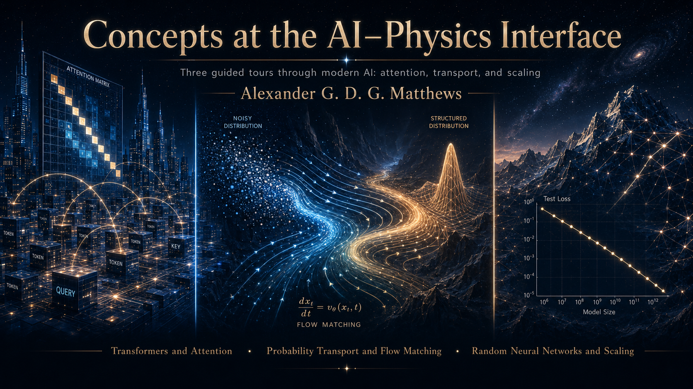

Lecture notes for a three-lecture series at the Cavendish Laboratory,
University of Cambridge.

[Lecture 1](slides/alexmatthews_attention_transformers.pdf): A Hitchhiker’s Guide to Transformers and Attention

Abstract: In 2017 the paper "Attention Is All You Need" slightly vandalised Lennon and McCartney’s original sentiment, but from a technical perspective the authors turned out to have a point. Transformers now sit at the centre of much of modern generative AI, from large language models to code-generation and multimodal systems. This lecture will give an introduction to transformers and self-attention, with an emphasis on the key concepts rather than implementation details. I will assume little background at the start, but the pace will pick up once the basic ingredients are in place.

This is part 1/3 of the “Concepts at the AI–physics interface” lecture series. The lecture is designed to be fairly self-contained, while also introducing ideas and notation that will reappear in the later talks. It is the most generalist lecture in the series.

[Lecture 2](slides/alexmatthews_transport_flow_matching.pdf): Probability transport and flow matching, with connections to diffusion models
 
Abstract: The problem of transporting one probability distribution to another appears throughout science. Through diffusion models, rectified flows, and flow matching, it has also become central to modern generative AI, with applications ranging from natural image generation to protein structure generation/design. This lecture will take flow matching and rectified flow as the most direct route into the topic, before briefly explaining the relation to diffusion models. The exposition will be more mathematical than most first introductions to the subject, with an emphasis on the underlying probability flows rather than implementation details.

This is part 2/3 of the “Concepts at the AI–physics interface” lecture series. Newcomers to machine learning may benefit from the context introduced in the first lecture, but it is not essential.

[Lecture 3](slides/alexmatthews_neural_scaling_limits.pdf): Random neural networks, training dynamics, and scaling behaviour

Abstract: In this talk I will discuss theoretical models of the training dynamics of deep neural networks, particularly those drawing on probability theory and statistical physics. Such ideas have played an important role in the history of neural network theory, and remain important in current attempts to understand modern AI systems. I will give a critical overview of mean field approaches, Gaussian process limits, and the Neural Tangent Kernel. I will close with some comments on how these perspectives connect to more recent topics in AI research, including neural scaling laws. I will argue that this research area is particularly well suited to theoretical physicists, and to condensed matter theorists in particular.

This is part 3/3 of the “Concepts at the AI–physics interface” lecture series. Newcomers to machine learning may benefit from the context introduced in the first lecture, but it is not essential.